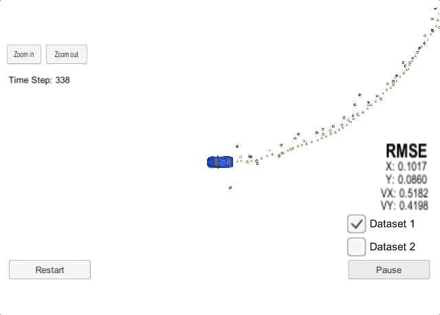
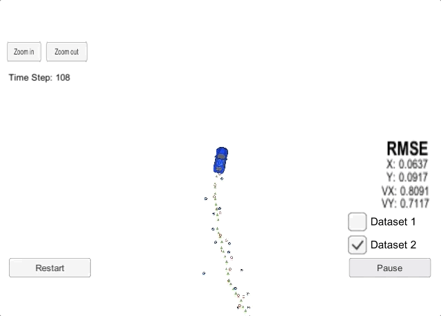

# Extended Kalman Filter(EKF) for Sensor Fusion-based 
### Object tracking demo OUTPUT
  
---
This repository includes two files that can be used to set up and install [uWebSocketIO](https://github.com/uWebSockets/uWebSockets) for either Linux or Mac systems. For windows you can use either Docker, VMware, or even [Windows 10 Bash on Ubuntu](https://www.howtogeek.com/249966/how-to-install-and-use-the-linux-bash-shell-on-windows-10/) to install uWebSocketIO. Please see the uWebSocketIO Starter Guide page in the classroom within the EKF Project lesson for the required version and installation scripts.

Once the install for uWebSocketIO is complete, the main program can be built and run by doing the following from the project top directory.
```shell
	mkdir build
	cd build
	cmake ..
	make
	./ExtendedKF
```
This project involves the Term 2 Simulator which can be downloaded [here](https://github.com/udacity/self-driving-car-sim/releases)

---
## The OUTPUT 
### 1.Dataset1
  
### 2.Dataset2
  

## Detail of SRC

